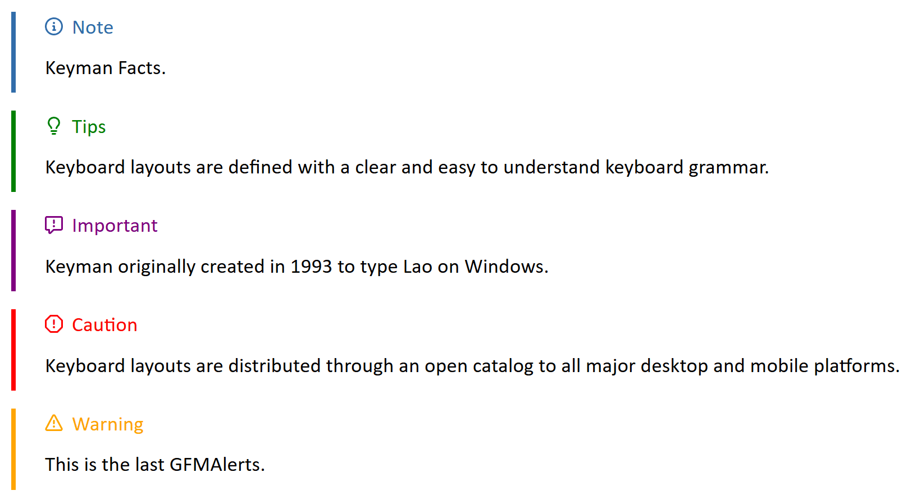
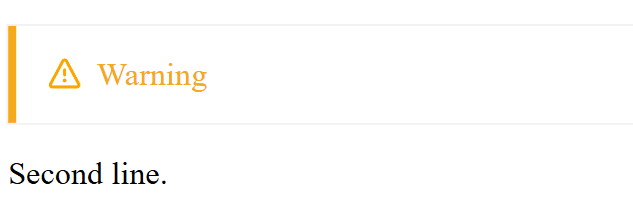
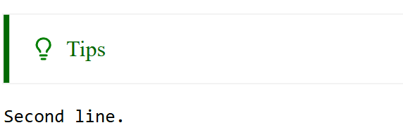
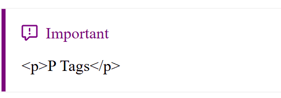

# Common Files

These files are common to keyman.com sites. Some or all of the files will be
deployed to keyman sites automatically as part of bootstrap.inc.sh.

## Namespace

The root namespace for all PHP modules is `Keyman\Site\Common`.

# GFMAlerts (GitHub Flavored Markdown Alerts)

Here are the syntaxes of the Alerts for Keyman websites. There are 5 types of GFMAlerts:


## Working with Alerts

The Five Alerts (Note, Tips, Important, Caution, and Warning) are recognized inside the `[! ]`. This should be able to support multiple lines as long as it is continuing from the previous alerts. Please find the examples below.

* One Alert

```md
> [!NOTE] 
> Keyman Facts.

```

* More than one

```md
> [!TIPS] 
> Keyboard layouts are defined with a clear and easy to understand keyboard grammar.
                                                              
> [!IMPORTANT] 
> Keyman originally created in 1993 to type Lao on Windows.
> Support new lines.

> [!CAUTION] 
> Keyboard layouts are distributed through an open catalog to all major desktop and mobile platforms.
Continue your Markdown documentation.
> [!WARNING] 
> This is the last GFMAlerts.

```

## Limitation

The Alerts can't recognize the inline content and HTML tags. Please stick to the rules/syntax.

1. Not using the `>`

```md
> [!WARNING] DO NOT do this.        // Only [!Warning] will show up.

> [!WARNING] DO NOT do this.
Second line                
```
Output:

     

2. Indent the second line

```md
> [!TIPS] DO NOT do this.
    Second line                  

```
Output: 


3. Using HTML Tags

```md
> [!IMPORTANT]
> <p>P Tags</p>

```

Output:


4. Not completing the Format

```md
> [!TIPS] 
> [!IMPORTANT]

> Do NOT do this.       // This will cost an error, but still renders.
```

Output:

