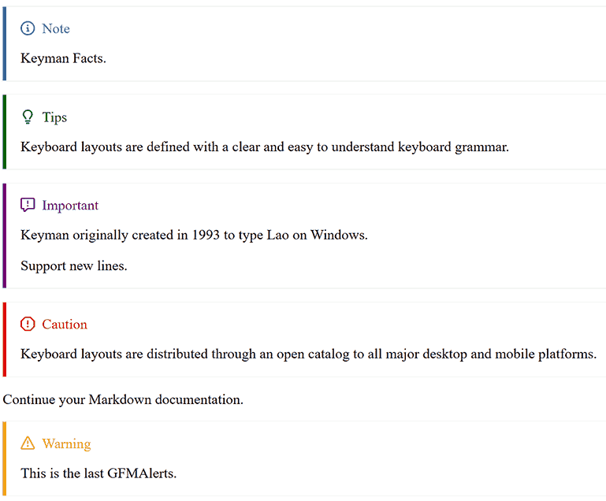

# Common Files

These files are common to keyman.com sites. Some or all of the files will be
deployed to keyman sites automatically as part of bootstrap.inc.sh.

## Namespace

The root namespace for all PHP modules is `Keyman\Site\Common`.

# GFMAlerts (GitHub Flavored Markdown Alerts)

Here are the syntaxes of the Alerts for Keyman websites. There are 5 types of GFMAlerts:


## Working with Alerts

For every Alert that is used, there should be a gap in between each Alert, then a blank comment. After that, the next Alerts can be used.

* One Alert

```md
> [!NOTE] Keyman Facts.

```

* More than one

```md
> [!TIPS] Keyboard layouts are defined with a clear and easy to understand keyboard grammar.
                                                                                    // Always leave a line break.
<!-- Must Include a blank comment between each Alerts -->
> [!IMPORTANT] Keyman originally created in 1993 to type Lao on Windows.

<!--  -->
> [!CAUTION] Keyboard layouts are distributed through an open catalog to all major desktop and mobile platforms.

<!-- Last comment -->
> [!WARNING] This is the last GFMAlerts.

```

## Limitation

The Alerts can't recognize new lines, HTML tags, nor handle two lines or more.

```md
> [!WARNING] DO NOT do this.
> Second line                   // this will cause a 500 Error

<!--  -->
> [!WARNING] DO NOT do this.
Second line                     // this will cause a 500 Error

<!--  -->
> [!WARNING] DO NOT do this.
    Second line                 // this will cause a 500 Error

```